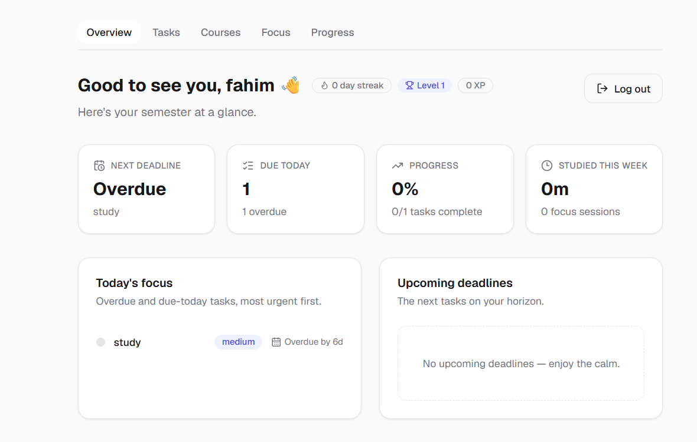
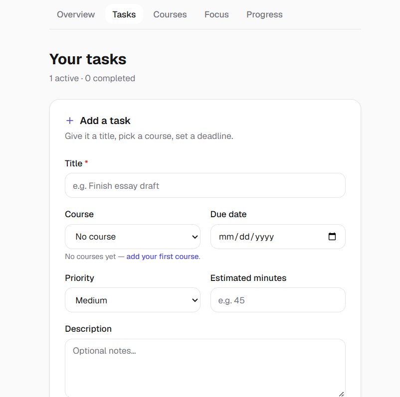
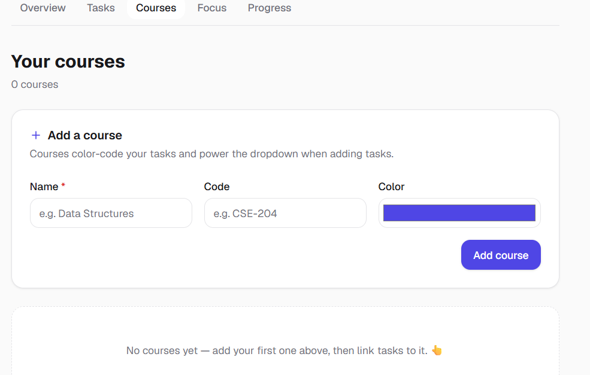
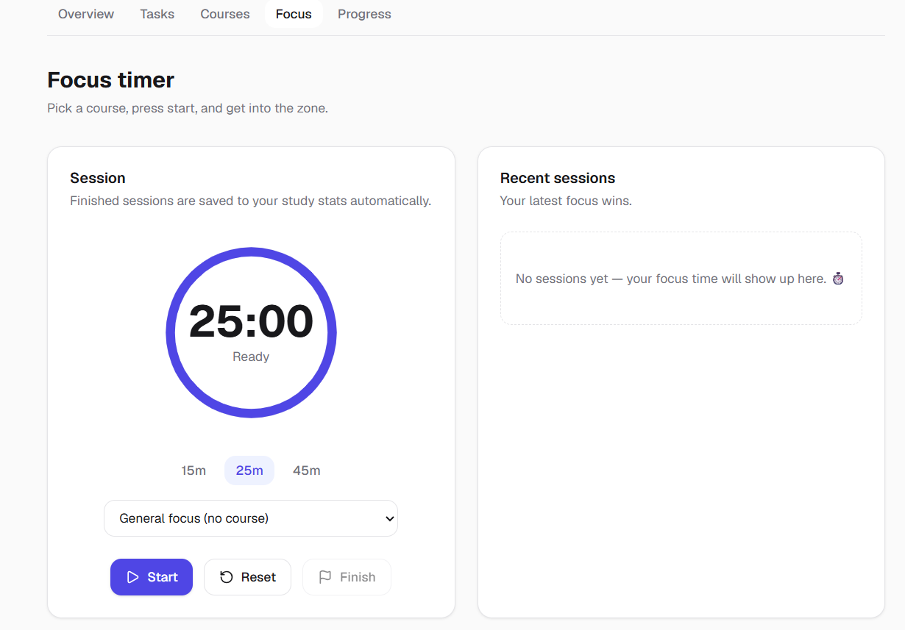
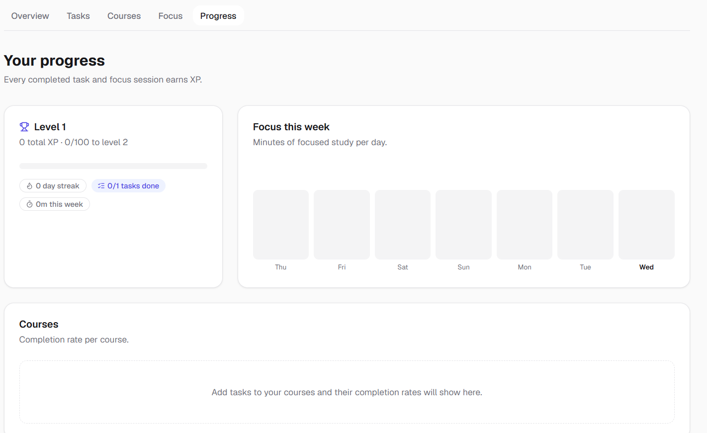

# Campus Hub

> Your student operating system — plan your semester, manage deadlines, study
> smarter, all in one place.

Campus Hub is a student productivity app in active development (V1). Tasks,
deadlines, courses, a pomodoro focus timer, and quiet gamification (XP, levels,
streaks) — built to be fast, calm, and useful on day one.

## ✨ Features (V1)

| Area | What you get |
| --- | --- |
| **Auth** | Email/password signup & login via Supabase, protected routes, lazy profile creation |
| **Dashboard** | Personalized greeting, streak/level/XP badges, next deadline, due-today count, progress % and weekly study time |
| **Tasks** | Title, course, due date, priority, estimated minutes, description — add, edit, complete, delete |
| **Courses** | Color-coded courses that group your tasks and power the task dropdown |
| **Focus timer** | 15/25/45 min sessions with a progress ring; finished sessions auto-save with XP |
| **Progress** | Level curve, XP bar, day streak, weekly study bar chart, per-course completion |
| **Responsive** | Works from a 320 px phone up to desktop; landing nav scrolls, grids stack, timer scales |

### Coming soon (not built yet — the landing page says so)
- AI study assistant
- Career tools
- Emergency help

## 🧰 Tech stack

- **Framework:** Next.js 16 (App Router, server actions, `proxy.ts` middleware)
- **UI:** React 19, TypeScript, Tailwind CSS v4, lucide-react
- **Data:** Supabase (Postgres + Auth), zod validation
- **Design:** Custom design tokens, hand-rolled UI primitives (no component library)

## 🚀 Getting started

### 1. Prerequisites

- Node.js 20+
- A Supabase project (free tier is fine)

### 2. Install & configure

```bash
git clone <your-repo-url> campus-hub
cd campus-hub
npm install
```

Copy the environment template and fill in your Supabase values:

```bash
cp .env.example .env.local
```

| Variable | Where to find it |
| --- | --- |
| `NEXT_PUBLIC_SUPABASE_URL` | Supabase → Project Settings → API |
| `NEXT_PUBLIC_SUPABASE_ANON_KEY` | Same page (publishable key) |
| `NEXT_PUBLIC_SITE_URL` | `http://localhost:3000` locally; your Vercel URL in prod |

### 3. Database

Open `supabase/v1_schema.sql` in the [Supabase SQL Editor](https://supabase.com/dashboard/project/_/sql/new)
and run it. It creates:

- `profiles`, `courses`, `tasks`, `study_sessions` tables
- Row-level security (per-user, `auth.uid()`)
- The `handle_new_user` trigger (auto-creates a profile on signup)

### 4. Run it

```bash
npm run dev
```

Open http://localhost:3000, sign up, and you're in.

## 📁 Project structure

```
src/
├── app/
│   ├── actions/          # Server actions (auth, tasks, courses, sessions)
│   ├── auth/callback/    # OAuth-ish email confirmation callback
│   ├── dashboard/        # Overview, tasks, courses, focus, progress
│   ├── login/ signup/    # Auth pages
│   └── page.tsx          # Landing page
├── components/
│   ├── ui/               # Button, Card, Input, Select, Badge, Textarea
│   ├── dashboard/        # AppNav, StatCard, DeadlineList
│   ├── tasks/ courses/ focus/ progress/   # Feature components
│   └── landing/          # Hero, Features, Roadmap, FAQ, CTA…
├── lib/
│   ├── queries.ts        # Typed data access (all queries here)
│   ├── gamification.ts   # XP / level / streak math + writes
│   ├── auth.ts           # requireUser, getUser (cached)
│   ├── dates.ts          # Date helpers
│   ├── database.types.ts # Row types + join shapes
│   └── supabase/         # Server, client, middleware clients
├── proxy.ts              # Session refresh + route protection
└── app/globals.css       # Design tokens (@theme)
```

## 🗄️ Data model

| Table | Purpose |
| --- | --- |
| `profiles` | XP, level, streak, display name |
| `courses` | Name, code, color — owned by a user |
| `tasks` | Course (nullable), due date, priority, estimated minutes, status |
| `study_sessions` | Started/completed timestamps, duration, optional course |

Every table is scoped by `user_id` with matching RLS policies (defense in
depth — queries filter by user *and* RLS enforces it).

## 🎮 Gamification rules

- **XP:** +10 for completing a task · +1 per focus minute
- **Levels:** `level = ⌊√(xp/100)⌋ + 1` — level 1 at 0 XP, 2 at 100, 3 at 400…
- **Streak:** consecutive active days grow it; a gap resets to 1; same-day
  activity is idempotent

## 📜 Scripts

```bash
npm run dev      # Start the dev server (Turbopack)
npm run build    # Production build
npm run start    # Serve the production build
npm run lint     # ESLint
```

## ☁️ Deployment (Vercel)

1. Push this repo to GitHub (public or private).
2. Import it in Vercel — framework preset **Next.js** is auto-detected.
3. Add the three `NEXT_PUBLIC_*` env vars (pointing at your Supabase project).
4. In Supabase → Authentication → URL Configuration, add your Vercel URL to
   redirect allowlist, and set `NEXT_PUBLIC_SITE_URL` to the Vercel URL.
5. Deploy. ✅

## 🖼️ Screenshots

| Dashboard | Tasks |
| --- | --- |
|  |  |

| Courses | Focus timer |
| --- | --- |
|  |  |

| Progress |
| --- |
|  |

## 📄 License

Private — all rights reserved.